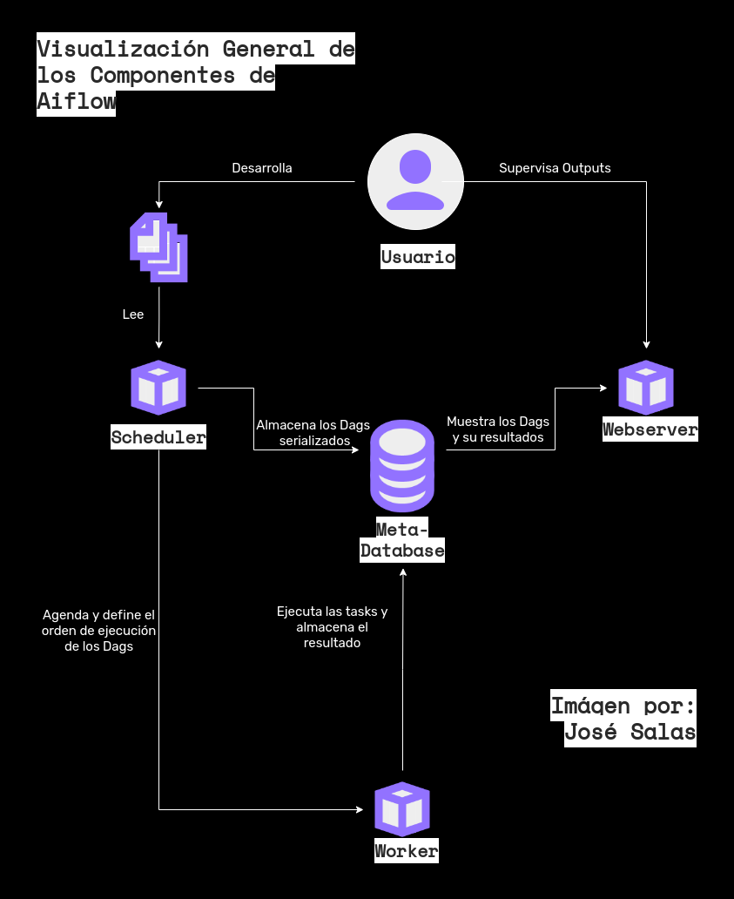

<head>
    <meta http-equiv="Content-Type"content="text/html"charset="utf-8">
    <link href="./css_estilos/estilo_01.css"rel="stylesheet"type="text/css"> 
</head>

<div id='id0' > </div>

<body>
    <h1> <b> Dockerización de Apache Airflow para la Automatización de ETL </b> </h1>
</body>

<body>
    <h2> <b> Índice </b> </h2>
</body>

1.  [<p style="font-family: rubik"> Enunciado del Reto. </p>](#id1)
2.  [<p style="font-family: rubik"> Poblemática. </p>](#id2)
3.  [<p style="font-family: rubik"> Propuesta Metodológica. </p>](#id3)
4.  [<p style="font-family: rubik"> Herramientas Utilizadas. </p>](#id4)
5.  [<p style="font-family: rubik"> Análisis Exploratorio de Datos. </p>](#id5)
6.  [<p style="font-family: rubik"> Variables de Entorno. </p>](#id6)
7.  [<p style="font-family: rubik"> Configuración. </p>](#id7)
8.  [<p style="font-family: rubik"> Ejecución. </p>](#id8)

---

<div id='id1' > </div>

<body>
    <h2> <b> Enunciado del Proyecto (Flujos de Ejecución) </b> </h2>
    <p>
    Para acceder al enunciado del proyecto haz clíck en:
    </p>
</body>

[<p style="font-family: rubik"> Enunciado </p>](casos_da_py.pdf)

[<p style="font-family: rubik"> Índice </p> ](#id0)

---

<div id='id2' > </div>

<body>
    <h2> <b> Problemática </b> </h2>
    <p>
    Para llevar a cabalidad la misión de asesorar al Ministerio de Educación, Ciencia y Tecnología de Argentina, el Consejo Nacional de Calidad de la Educación (<b>CNCE</b>) debe comparar la información de instituciones universitarias disponibles con la suminsitrada por dichas casas de estudios, (públicas y privads), para determinar aquellos programas en los que se requiere que el ente regulador facilite el acceso a programas de becas, matriculacion, entre otras directrices estratégicas.<br>
    <br>
    En ese sentido <b>CNCE</b> debe contar con una infraestructura ágil y robusta que le permita analizar los datos disponible y obtener información relevante con respecto a la calidad de los programas e instituciones educativas que monitorea.

[<p style="font-family: rubik"> Índice </p> ](#id0)

---

<div id='id3' > </div>

<body>
    <h2> <b> Propuesta Metodológica </b> </h2>
    <p>
    El proceso de extracción, transformación y carga (<b>ETL</b>: Extract, Transform and Load ) puede ser dividido en un conjunto de subtareas, ejecutadas de manera dirigida y aciclica para facilitar el despliegue de la infraestructua y su automatización, mediante un orquestador. <br>
    <br>
    A la hora de hacer el despliegue y ejecución del <b>ETL</b> es necesario garantizar que tanto el proceso en sí, como el orquestador, sean capaz de ejecutarse en cualquier ordenador, es por ello que se debe definir un entorno de desarrollo, el cual pueda ser ejecutado por el usuario para que el <b>ETL</b> y el orquestador corran sobre este y no localmente, de tal forma que la ejecución no sea interrumpida por errores asociados a dependencias o versionado. <br>
    <br>
    Las tareas fueron modeladas como Grafos Aciclicos Dirigidos (<b>DAG</b>: Directed Acyclic Graph) para ser automatizadas mediante el orquestador de flujos de trabajo: Apache Airflow. <br>
    <br>
    Para el desarrollo y ejecución se implemento Docker y a partir de este se levantaron cinco contenedores, en cada uno de los cuales corre uno de cinco servicios, respectivamente:
    <ul>
            <li> <b> <p> 
            Airflow Scheduler
            </b>: Monitorea las tareas y activa las instancias una vez que las dependencias han sido completadas.  </p> </li>
            <li> <b> <p> 
            Airflow Webserver
            </b>: Interfaz de usuario disponible a través del navegador
            (ver).  </p> </li>
            <li> <b> <p> 
            Airflow Worker
            </b>: Ejecuta las tareas dadas por el "scheduler".  </p> </li>
            <li> <b> <p> 
            Airflow Init
            </b>: Activa la base de datos y carga la credenciasles del usuario.  </p> </li>
            <li> <b> <p> 
            Postgres
            </b>: Base de datos en la cual se almacenan los metadatos generados por el orquestador.  </p> </li>
            <li> <b> <p> 
            Redis
            </b>: Intermediario que reenvía mensajes del "scheduler" al "worker".  </p> </li>
    </ul>  
    </p>
</body>



[<p style="font-family: rubik"> Índice </p> ](#id0)

---

<div id='id4' > </div>

<body>
    <h2> <b> Herramientas Utilizadas </b> </h2>
    <p>
        <ul>
            <li> <b> <p> 
            Docker
            </b>: La versión utilizada es la 3.8, los servicios de <b> Aiflow </b>, <b> Postgres </b> y <b> Redis </b> son declarados directamente en el archivo .yml. </p> </li>
            <li> <b> <p> 
            Docker-compose
            </b>: La versión utilizada es la 3.8. </p> </li>           
            <li> <b> <p> 
            Postgres
            </b>: La versión utilizada es la 14.3.   </p> </li>
            <li> <b> <p> 
            Redis
            </b>: Última versión.   </p> </li>
            <li> <b> <p> 
            Python
            </b>: La versión utilizada es la 3.10. </p> </li>
            <li> <b> <p> 
            Librerías
            </b>: 
                <ul>
                    <li> <p> Airflow. </p> </li>
                    <li> <p> Datetime (módulo). </p> </li>
                    <li> <p> Logging (módulo). </p> </li>
                    <li> <p> SQLalchemy. </p> </li>
                    <li> <p> SQLalchemy Utils. </p> </li>
                    <li> <p> Python-decouple (módulo). </p> </li>
                    <li> <p> Os (módulo). </p> </li>
                    <li> <p> Pandas. </p> </li>
                    <li> <p> Psycopg2. </p> </li>
                    <li> <p> Pathlib (módulo). </p> </li>
                    <li> <p> Time (módulo). </p> </li>
                </ul>
            </p> </li>
        </ul>
    </p>
</body>

<body>
    <p>
    Las librerías requeridas son instaladas en Airflow, mediante extensión de la imagen a través del Dockerfile:
    <br>
    </p>
</body>

[<p style="font-family: rubik"> Dockerfile </p> ](Dockerfile)

<body>
    <p>
    Las librerías son especifícadas en el archvio .txt:
    <br>
    </p>
</body>

[<p style="font-family: rubik"> requirements.txt </p> ](./core_app/requirements.txt)

[<p style="font-family: rubik"> Índice </p> ](#id0)

---

<div id='id5' > </div>

<body>
    <h2> <b> Análisis Exploratorio de Datos</b> (EDA: Exploratory Data Analysis) </h2>
    <p>
    Para acceder al EDA haz clíck en:
    </p>
</body>

[<p style="font-family: rubik"> EDA </p>](eda.ipynb)

[<p style="font-family: rubik"> Índice </p> ](#id0)

---

<div id='id6' > </div>
 
<body>
    <h2> <b> Variables de Entorno </b> </h2>
    <p>
    La infraestrucutra cuenta con las siguiente variables de entorno:
    <ul>
        <li> <b> <p> 
        Credenciales de Usuario: Airflow</b>. </p> </li>
        <ul>
            <li> <b> <p>
            AIRFLOW_UID
            </b>: < value > corresponde al id del usuario. </p> </li>
            <li> <b> <p>
            AIRFLOW_GID
            </b>: < value > (credencial de acceso) corresponde a los permisos conferidos al usuario. </p> </li>
        </ul>
    </ul>   
</body>

<body>  
    <ul>
    <li> <b> <p> 
    Credenciales de Usuario: Postgres</b>. </p> </li>
        <ul>
            <li> <b> <p>
            POSTGRES_USER
            </b> < value > (credencial de acceso) corresponde al usuario de la base de datos. </p> </li>
            <li> <b> <p>
            POSTGRES_PASSWORD 
            </b> < value > (credencial de acceso) corresponde a la contraseña de la base de datos. </p> </li>
            <li> <b> <p>
            POSTGRES_PORT
            </b> el valor por defecto es <b> "5432"</b> y es especificado en el archivo .yml. </p> </li>
            <li> <b> <p>
            PG_DATA
            </b> ruta donde se almacena la información de la base de datos. </p> </li>   
        </ul>
    Estás variables pertmiten a Docker Compose crear todos los servicios, se encuentran disponibles en el archivo de configuración:  
    </ul>
</body>

[<p style="font-family: rubik"> ENV </p>](.env)

[<p style="font-family: rubik"> Índice </p> ](#id0)

---

<div id='id7' > </div>

<body>
    <h2> <b> Configuración </b> </h2>
    <p>
    Para cambiar la configuración del entorno se pueden asignar/mondificar el valor de las variables contenidas en el archivo de configuración.
    </p>
</body>

<body>
    Las varaibles de entorno están definidas por defecto, se recomienda su modificación con discrción.
    </p>
</body>

[<p style="font-family: rubik"> Índice </p> ](#id0)

---

<div id='id8' > </div>

<body>
    <h2> <b> Ejecución </b> </h2>
    <p>
    <ol>
        <li> <p> Clonar o descargar el repositorio. </p> </li>
        <li> <p> Abrir la terminal de comandos. </p> </li>
        <li> <p> Acceder al directorio <b> airflow_docker</b>. </p> </li>
        <li> <p> Ejecutar el comando <b> docker-compose build</b>. </p> </li> 
        <li> <p> Ejecutar el comando <b> docker-compose up airflow-init</b> para inicializar la base de datos. </p> </li>
        <li> <p> Ejecutar el comando <b> docker-compose up</b> para iniciarlizar el resto de los servicios. </p> </li>                
    </ol>
    </p>
    <h2> <b> Acceso Airflow Webserver</b> </h2>
</body>

```
URL: http://localhost:8080 (desde el navegador)
username: airflow (por defecto)
password: airflow (por defecto)
```

[<p style="font-family: rubik"> Índice </p> ](#id0)

---
